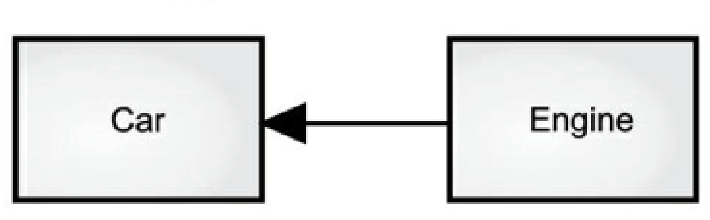
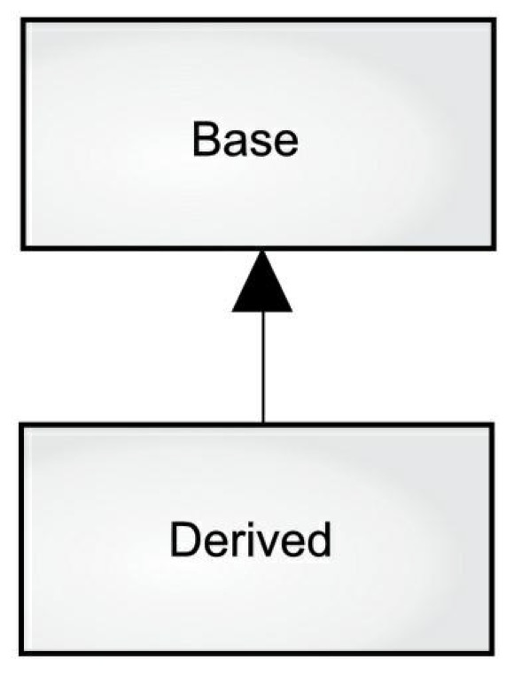

# What is an Object?

>“We do not realize what tremendous power the structure of an habitual language has. It is not an exaggeration to say that it enslaves us through the mechanism of semantic reactions and that the structure which a language exhibits, and impresses upon us unconsciously, is automatically projected upon the world around us.”—Alfred Korzybski (1930) 

The genesis of the computer revolution was in a machine. Our programming languages thus tend to look like that machine.

But computers are not so much machines as they are mind amplification tools (“bicycles for the mind,” as Steve Jobs was fond of saying) and a different kind of expressive medium. As a result, tools are beginning to look less like machines and more like parts of our minds.

Programming languages are the fabric of thought for creating

applications. Languages take inspiration from other forms of expression such as writing, painting, sculpture, animation, and filmmaking.

Object-oriented programming (OOP) is one experiment in using the computer as an expressive medium.

Many people feel uncomfortable wading into object-oriented programming without understanding the big picture, so the concepts introduced here give you an overview of OOP. Others might not understand such an overview until they are exposed to the mechanism, becoming lost without seeing code. If you’re part of this latter group and are eager to get to the specifics of the language, feel free to jump past this chapter—skipping it now will not prevent you from writing programs or learning the language. However, come back here eventually to fill in your knowledge so you understand why objects are important and how to design with them.

This chapter assumes you have some programming experience, although not necessarily in C. If you need more preparation in programming before tackling this book, work through the Thinking in C multimedia seminar, freely downloadable from www.OnJava8.com. 

##  The Progress of Abstraction 

All programming languages are abstractions. It can be argued that the complexity of the problems you’re able to solve is directly related to the kind and quality of abstraction. By “kind” I mean, “What is it you are abstracting?” Assembly language is a minimal abstraction of the underlying machine. Many so-called “imperative” languages (such as FORTRAN, BASIC, and C) were themselves abstractions of assembly language. Although they were big improvements, their primary abstraction still requires you to think in terms of the structure of the computer rather than the structure of the problem you are trying to solve. The programmer must establish the association between the machine model (the “solution space,” the place where you’re implementing that solution, such as a computer) and the model of the problem that is actually solved (the “problem space,” the place where the problem exists, such as a business). The effort required to perform this mapping, and the fact it is extrinsic to the programming language, produces programs that are difficult to write and expensive to maintain.

The alternative to modeling the machine is to model the problem you’re trying to solve. Early languages such as LISP and APL chose particular views of the world (“All problems are ultimately lists” or “All problems are algorithmic,” respectively). Prolog casts all problems into chains of decisions. Languages have been created for constraint-based programming and for programming exclusively by manipulating graphical symbols. Each of these approaches can be a good solution to the particular class of problem they’re designed to solve, but when you step outside of that domain they become awkward.

The object-oriented approach goes a step further by providing tools for the programmer to represent elements in the problem space. This representation is general enough that the programmer is not constrained to any particular type of problem. We refer to the elements in the problem space and their representations in the solution space as “objects.” (Note that some objects don’t have problem-space analogs.) The idea is that the program adapts itself to the lingo of the problem by adding new types of objects. When you read the code describing the solution, you’re reading words that also express the problem. This is a more flexible and powerful language abstraction than what we’ve had before. Thus, OOP describes the problem in terms of the problem, rather than in terms of the computer where the solution will run. There’s still a connection, because objects look somewhat like little computers: Each has state and performs operations. This is similar to objects in the real world—they all have characteristics and behaviors.

Alan Kay summarized five basic characteristics of SmallTalk, the first successful object-oriented language and a language that inspired Java. These characteristics represent a pure approach to object-oriented programming:

**1. Everything is an object.** Think of an object as a fancy variable; it stores data, but you can “make requests”, asking it to perform operations on itself. You can usually take any conceptual component in the problem you’re trying to solve (dogs, buildings, services, etc.) and represent it as an object in your program.

**2. A program is a bunch of objects telling each other what to do by sending messages.** When you “send a message” to an object, it’s a request to call a method that belongs to that object.

**3. Each object has its own memory made up of other objects.** Put another way, you create a new kind of object by packaging existing objects. This hides the complexity of a program behind the simplicity of objects.

**4. Every object has a type.** Each object is an instance of a class, where “class” is (approximately) synonymous with “type.” The most important distinguishing characteristic of a class is “What messages can you send to it?”

**5. All objects of a particular type can receive the same messages.** This is a loaded statement, as you will see later. Because an object of type “circle” is also an object of type “shape,” a circle is guaranteed to accept shape messages. This means you can write code that talks to shapes and automatically handles anything that fits the description of a shape. This substitutability is a foundation of OOP.

Grady Booch offers an even more succinct description of an object: 

> *An object has state, behavior and identity*

This means an object can have internal data (which gives it state),

methods (to produce behavior), and each object is uniquely distinguished from every other object—that is, every object has a unique address in memory. 1 

##  An Object Has an Interface 

Aristotle was probably the first to begin a careful study of the concept of type; he spoke of “the class of fishes and the class of birds.” The idea that all objects, while unique, are also part of a class of objects that have characteristics and behaviors in common was used directly in the first object-oriented language, Simula-67, with its fundamental keyword **class** that introduces a new type into a program. Simula, as its name implies, was created for developing simulations such as the classic “bank teller problem.” In this, you have numerous tellers, customers, accounts, transactions, and units of money—many “objects.” Objects that are identical except for their state are grouped together into “classes of objects,” and that’s where the keyword class arose.

Creating abstract data types (classes) is a fundamental concept in object-oriented programming. Abstract data types work almost exactly like built-in types: You create variables of a type (called objects or instances in object-oriented parlance) and manipulate those variables (called sending messages or requests; you send a message and the object figures out what to do with it). The members (elements) of each class share some commonality: Every account has a balance, every teller can accept a deposit, etc. At the same time, each member has its own state: Each account has a different balance, each teller has a name. Thus, the tellers, customers, accounts, transactions, etc., can each be represented with a unique entity in the program. This entity is the object, and each object belongs to a particular class that defines its characteristics and behaviors.

So, although what we really do in object-oriented programming is create new data types, virtually all object-oriented programming languages use the “class” keyword. When you see the word “type” think “class” and vice versa.2 Since a class describes a set of objects that have identical characteristics (data elements) and behaviors (functionality), a class is really a data type because a floating point number, for example, also has a set of characteristics and behaviors. The difference is that a programmer defines a class to fit a problem rather than being forced to use an existing data type that was designed to represent a unit of storage in a machine. You extend the programming language by adding new data types specific to your needs. The programming system welcomes the new classes and gives them the same care and type checking it gives to built-in types.

The object-oriented approach is not limited to building simulations. Whether or not you agree that any program is a simulation of the system you’re designing, OOP techniques help reduce a large set of problems to a simpler solution.

Once a class is established, make as many objects of that class as you like, then manipulate those objects as if they are the elements that exist in your problem. Indeed, one of the challenges of object-oriented programming is creating a one-to-one mapping between the elements in the problem space and objects in the solution space.

How do you get an object to do useful work? You make a request of that object—complete a transaction, draw something on the screen, turn on a switch. Each object accepts only certain requests, defined by its interface The type determines the interface. As a simple example, consider a representation for a light bulb:


```java
Light lt = new Light(); 
lt.on(); 
```

The interface determines the requests you can make for a particular object. However, there must be code somewhere to satisfy that request. This, along with the hidden data, comprises the implementation. A type has a method associated with each possible request, and when you make a particular request to an object, that method is called. This process is usually summarized by saying you “send a message” (make a request) to an object, and the object figures out what to do with that message (it executes code).

Here, the name of the class is Light, the name of this particular Light object is lt, and the requests you can make of a Light object are to turn it on, turn it off, make it brighter, or make it dimmer. You create a Light object by defining a “reference” (lt) for that object and calling new to request a new object of that type. To send a message to the object, you state the name of the object and connect it to the message request with a period (dot). From the standpoint of the user of a predefined class, that’s pretty much all there is to programming with objects.

The preceding diagram follows the format of the Unified Modeling Language (UML). Each class is represented by a box, with the type name in the top portion of the box, any data members you care to describe in the middle portion of the box, and the methods (the functions that belong to this object, which receive any messages you send to that object) in the bottom portion of the box. Often, only the name of the class and the public methods are shown in UML design diagrams, so the middle portion is not shown, as in this case. If you’re interested only in the class name, the bottom portion doesn’t need to be shown, either.

##  Objects Provide Services 

When trying to develop or understand a program design, an excellent way to think about objects is as “service providers.” Your program itself will provide services to the user, and it will accomplish this by using the services offered by other objects. Your goal is to produce (or better, locate in existing code libraries) a set of objects providing the ideal services to solve your problem.

A way to start doing this is to ask, “If I could magically pull them out of a hat, what objects would solve my problem right away?” For example, suppose you are creating a bookkeeping program. You might imagine objects that contain predefined bookkeeping input screens, other objects that perform bookkeeping calculations, and an object that handles printing of checks and invoices on all different kinds of printers. Maybe some of these objects already exist, and for the ones that don’t, what would they look like? What services would those objects provide, and what objects would they need to fulfill their obligations? If you keep doing this, you eventually reach a point where you say either, “That object seems simple enough to sit down and write” or “I’m sure that object must exist already.” This is a reasonable way to decompose a problem into a set of objects.

Thinking of an object as a service provider has an additional benefit: It

helps improve the cohesiveness of the object. High cohesion is a fundamental quality of software design: It means the various aspects of a software component (such as an object, although this could also apply to a method or a library of objects) “fit together” well. One problem people have when designing objects is cramming too much functionality into one object. For example, in your check printing module, you might decide you need an object that knows all about formatting and printing. You’ll probably discover this is too much for one object, and that what you need is three or more objects. One object might be a catalog of all the possible check layouts, which can be queried for information about how to print a check. One object or set of objects can be a generic printing interface that knows all about different kinds of printers (but nothing about bookkeeping—that is a candidate for buying rather than writing yourself). A third object uses the services of the other two to accomplish the task. Thus, each object has a cohesive set of services it offers. In good object-oriented design, each object does one thing well, but doesn’t try to do too much. This not only discovers objects that might be purchased (the printer interface object), but it also produces new objects that might be reused somewhere else (the catalog of check layouts).

Treating objects as service providers is useful not only during the design process, but also when someone else is trying to understand your code or reuse an object. If they can see the value of the object based on what service it provides, it makes it much easier to fit it into the design.

##  The Hidden Implementation

We can break up the playing field into class creators (those who create new data types) and client programmers 3 (the class consumers who use the data types in their applications). The goal of the client programmer is to collect a toolbox full of classes to use for rapid application development. The goal of the class creator is to build a class that exposes only what’s necessary to the client programmer and keeps everything else hidden. Why? Because if it’s hidden, the client programmer can’t access it, which means the class creator can change the hidden portion at will without worrying about the impact on anyone else. The hidden portion usually represents the tender insides of an object that could easily be corrupted by a careless or uninformed client programmer, so hiding the implementation reduces program bugs.

All relationships need boundaries, respected by all parties involved.

When you create a library, you establish a relationship with the client programmer, who is also a programmer, but one who is putting together an application by using your library, possibly to build a bigger library. If all members of a class are available to everyone, the client programmer can do anything with that class and there’s no way to enforce rules. Even though you might prefer that the client programmer not directly manipulate some of the members of your class, without access control there’s no way to prevent it. Everything’s naked to the world.

So the first reason for access control is to keep client programmers’ hands off portions they shouldn’t touch—parts necessary for the internal operation of the data type but not part of the interface that users need to solve their particular problems. This is actually a service to client programmers because they can easily see what’s important and what they can ignore. (Notice this is also a philosophical decision. Some programming languages assume that if a programmer wishes to access the internals, they should be allowed.)

The second reason for access control is to enable the library designer to change the internal workings of the class without worrying about how it will affect the client programmer. For example, you might implement a particular class in a simple fashion to ease development, then later discover you must rewrite it to make it run faster. If the interface and implementation are clearly separated and protected, you can accomplish this easily. Java has three explicit keywords to set the boundaries in a class: public, private, and protected. These access specifiers determine who can use the definitions that follow. public means the element is available to everyone. private means no one can access that element except you, the creator of the type, inside methods of that type. private is a brick wall between you and the client programmer. Anyone trying to access a private member gets a compile-time error. protected acts like private, with the exception that an inheriting class may access protected members, but not private members. Inheritance is introduced shortly.

Java also has a “default” access, which comes into play if you don’t use one of the aforementioned specifiers. This is usually called package access because classes can access the members of other classes in the same package (library component), but outside the package those same members appear to be private.

##  Reusing the Implementation

Once a class is tested, it should (ideally) represent a useful unit of code. This reusability is not nearly so easy to achieve as many hope; it takes experience and insight to produce a reusable object design. But once you have such a design, it begs for reuse. Code reuse is an argument for object-oriented programming languages.

The simplest way to reuse a class is to use an object of that class directly, but you can also place an object of that class inside a new class. Your new class can be made up of any number and type of other objects, in any combination, to produce the desired functionality. Because you compose a new class from existing classes, this concept is

called composition (if composition is dynamic, it’s usually called aggregation). Composition is often called a has-a relationship, as in “A car has an engine.”



(This diagram indicates composition with the filled diamond, which states there is one car. I typically use a simpler form: just a line, without the diamond, to indicate an association.4 Composition comes with a great deal of flexibility. The member objects of your new class are typically private, making them inaccessible to client programmers who use the class. This means changing those members doesn’t disturb existing client code. You can also change the member objects at run time, to dynamically change the behavior of your program. Inheritance, described next, does not have this flexibility since the compiler must place compile-time restrictions on classes created using inheritance.

Inheritance is is often highly emphasized in object-oriented programming. A new programmer can get the impression that inheritance should be used everywhere. This can result in awkward and overly complicated designs. Instead, first look to composition when creating new classes, since it is simpler, more flexible, and produces cleaner designs. Once you’ve had some experience, it is reasonably obvious when you need inheritance. 

##  Inheritance

By itself, the idea of an object is a convenient tool. Objects package



data and functionality together by concept and represent an appropriate problem-space idea rather than being forced to use the idioms of the underlying machine. These concepts are expressed as fundamental units in the programming language by using the class keyword.

It seems a pity, however, to go to all the trouble to create a class, then be forced to create a brand new one that might have similar functionality. It’s nicer if we can take the existing class, clone it, then make additions and modifications to the clone. This is effectively what you get with inheritance, with the exception that if the original class (called the base class or superclass or parent class) is changed, the modified “clone” (called the derived class or inherited class or subclass or child class) also reflects those changes.

The arrow in this diagram points from the derived class to the base class. As you will see, there is commonly more than one derived class.

A type does more than describe the constraints on a set of objects; it also relates to other types. Two types can have characteristics and behaviors in common, but one type might contain more characteristics than another and might also handle more messages (or handle them differently). Inheritance expresses this similarity through the concept of base types and derived types. A base type contains all characteristics and behaviors shared among the types derived from it. You create a base type to represent the core of your ideas. From the base type, you derive other types to express the different ways this core can be realized.

For example, a trash-recycling machine sorts pieces of trash. The base type is “trash.” Each piece of trash has a weight, a value, and so on, and can be shredded, melted, or decomposed. From this, more specific types of trash are derived with additional characteristics (a bottle has a color, a steel can is magnetic) or behaviors (you can crush an aluminum can). In addition, some behaviors can be different (the value of paper depends on its type and condition). Using inheritance, you build a type hierarchy that expresses the problem you’re trying to solve in terms of its types.

A second example is the common “shape” example, perhaps used in a computer-aided design system or game simulation. The base type is “shape,” and each shape has a size, a color, a position, and so on. Each shape can be drawn, erased, moved, colored, etc. From this, specific types of shapes are derived (inherited)—circle, square, triangle, and so on—each of which can have additional characteristics and behaviors. Certain shapes can be flipped, for example. Some behaviors might be different, such as when you calculate the area of a shape. The type hierarchy embodies both the similarities and differences between the shapes. Casting the solution in the same terms as the problem is useful because you don’t need intermediate models to get from a description of the problem to a description of the solution. With objects, the type hierarchy is an important aspect of the model, so you go directly from the description of the system in the real world to the description of the system in code. Indeed, sometimes people who are trained to look for complex solutions have difficulty with the simplicity of object-oriented design.

Inheriting from an existing type creates a new type. This new type contains not only all the members of the existing type (although the private ones are hidden away and inaccessible), but more importantly it duplicates the interface of the base class. That is, all messages accepted by base-class objects are also accepted by derivedclass objects. We know the type of a class by the messages it accepts, so the derived class is the same type as the base class. In the previous example, “A circle is a shape.” This type equivalence via inheritance is one of the fundamental gateways in understanding the meaning of object-oriented programming.

Since both base class and derived class have the same fundamental interface, there must be some implementation to go along with that

interface. That is, there must be executable code when an object receives a particular message. If you inherit a class and don’t do anything else, the methods from the base-class interface come right along into the derived class. That means objects of the derived class have not only the same type, they also have the same behavior, which isn’t particularly interesting.

There are two ways to differentiate your new derived class from the original base class. The first is straightforward: add brand new methods to the derived class. These new methods are not part of the base-class interface. This means the base class didn’t do as much as you wanted, so you added more methods. This simple and primitive use for inheritance is, at times, the perfect solution to your problem. However, look closely for the possibility that your base class might also need these additional methods (or that you should be using composition instead). This process of discovery and iteration of your design happens regularly in object-oriented programming.

Although inheritance can sometimes imply (especially in Java, where the keyword for inheritance is extends) that you are going to add new methods to the interface, that’s not necessarily true. The second and more important way to differentiate your new class is to change the behavior of an existing base-class method. This is called overriding that method.

To override a method, you create a new definition for the method in the derived class. You’re saying, “I’m using the same interface method here, but I want it to do something different for my new type.”

Is-a vs. Is-Like-a Relationships There’s a certain debate that can occur about inheritance: Should inheritance override only base-class methods (and not add new methods that aren’t in the base class)? This would mean that the derived class is exactly the same type as the base class since it has exactly the same interface. As a result, you can perfectly substitute an object of the derived class for an object of the base class. This can be

thought of as pure substitution, and it’s often called the substitution principle 5. In a sense, this is the ideal way to treat inheritance. We often refer to the relationship between the base class and derived classes in this case as an is-a relationship, because you can say, “A circle is a shape.” A test for inheritance is to see if the is-a relationship makes sense for your classes.

Sometimes you add new interface elements to a derived type, thus extending the interface. The new type can still substitute for the base type, but the substitution isn’t perfect because your new methods are not accessible from the base type. This can be described as an is-like-a relationship (my term). The new type has the interface of the old type but it also contains other methods, so you can’t really say it’s exactly the same. For example, consider an air conditioner. Suppose your house is wired with all the controls for cooling; that is, it has an interface that to control cooling. Imagine that the air conditioner breaks down and you replace it with a heat pump, which can both heat and cool. The heat pump is-like-an air conditioner, but it can do more. Because the control system of your house is designed only to control cooling, it is restricted to communication with the cooling part of the new object. The interface of the new object is extended, and the existing system only knows about the original interface.

Once you see this design it becomes clear that the base class “cooling system” is not general enough, and should be renamed to “temperature control system” so it can also include heating—at which point the substitution principle will work. However, this diagram shows what can happen with design in the real world.

When you see the substitution principle it’s easy to feel like this approach (pure substitution) is the only way to do things, and in fact it is nice if your design works out that way. But you’ll find there are times when it’s equally clear you must add new methods to the interface of a derived class (extension). With inspection both cases should be reasonably obvious.

##  Interchangeable Objects with Polymorphism 

When dealing with type hierarchies, you often treat an object not as the specific type it is, but as its base type. This way you can write code that doesn’t depend on specific types. In the shape example, methods manipulate generic shapes, unconcerned about whether they’re circles, squares, triangles, or some shape that hasn’t even been defined yet. All shapes can be drawn, erased, and moved, so these methods send a message to a shape object without worrying how the object copes with the message. Such code is unaffected by the addition of new types, and adding new types is a common way to extend an object-oriented program to handle new situations. For example, you can derive a new subtype of shape called “pentagon” without modifying methods that deal only with generic shapes. This ability to easily extend a design by deriving new subtypes is one of the essential ways to encapsulate change. This improves designs while reducing the cost of software maintenance. There’s a problem when attempting to treat derived-type objects as their generic base types (circles as shapes, bicycles as vehicles, cormorants as birds, etc.). If a method tells a generic shape to draw itself, or a generic vehicle to steer, or a generic bird to move, the compiler cannot know at compile time precisely what piece of code is executed. That’s the whole point—when the message is sent, the programmer doesn’t want to know what piece of code is executed; the draw method can be applied equally to a circle, a square, or a triangle, and the object will execute the proper code depending on its specific type.

If you don’t need to know what piece of code is executed, when you add a new subtype, the code it executes can be different without requiring changes to the code that calls it. But what does the compiler do when it cannot know precisely what piece of code is executed? For example, in the following diagram the BirdController object just works with generic Bird objects and does not know what exact type they are. This is convenient from BirdControllers perspective because it doesn’t require special code to determine the exact type of Bird it’s working with or that Birds behavior. So how does it happen that, when move() is called while ignoring the specific type of Bird, the right behavior will occur (a Goose walks, flies, or swims, and a Penguin walks or swims)?

The answer is the primary twist of inheritance: The compiler cannot make a function call in the traditional sense. The function call generated by a non-OOP compiler produces what is called early binding, a term you might not have heard because you’ve never thought about it any other way. It means the compiler generates a call to a specific function name, which resolves to the absolute address of the code to be executed. With inheritance, the program cannot determine the address of the code until run time, so some other scheme is necessary when a message is sent to an object.

To solve the problem, object-oriented languages use the concept of late binding. When you send a message to an object, the code called isn’t determined until run time. The compiler does ensure that the method exists and performs type checking on the arguments and return value, but it doesn’t know the exact code to execute.

To perform late binding, Java uses a special bit of code in lieu of the absolute call. This code calculates the address of the method body, using information stored in the object (this process is covered in great detail in the Polymorphism chapter). Thus, each object behaves differently according to the contents of that special bit of code. When you send a message to an object, the object actually does figure out what to do with that message.

In some languages you must explicitly grant a method the flexibility of late-binding properties. For example, C++ uses the virtual keyword. In such languages, methods are not dynamically bound by default. In Java, dynamic binding is the default behavior and you don’t need extra keywords to produce polymorphism.

Consider the shape example. The family of classes (all based on the same uniform interface) was diagrammed earlier in this chapter. To demonstrate polymorphism, we write a single piece of code that ignores specific details of type and talks only to the base class. That code is decoupled from type-specific information and thus is simpler to write and easier to understand. And, if a new type—a Hexagon, for example—is added through inheritance, code works just as well for the new type of Shape as it did on the existing types. Thus, the program is extensible.

If you write a method in Java (you will soon learn how):

void doSomething(Shape shape) { shape.erase(); // ...

shape.draw(); } This method speaks to any Shape, so it is independent of the specific type of object it’s drawing and erasing. If some other part of the program uses the doSomething() method: Circle circle = new Circle(); Triangle triangle = new Triangle(); Line line = new Line(); doSomething(circle); doSomething(triangle); doSomething(line); The calls to doSomething() automatically work correctly, regardless of the exact type of the object.

This is a rather amazing trick. Consider the line: doSomething(circle); What’s happening here is that a Circle is passed into a method that expects a Shape. Since a Circle is a Shape it is treated as such by doSomething(). That is, any message that doSomething() can send to a Shape, a Circle can accept. It is a completely safe and logical thing to do.

We call this process of treating a derived type as though it were its base type upcasting. The name cast is used in the sense of casting into a mold and the up comes from the way the inheritance diagram is typically arranged, with the base type at the top and the derived classes fanning out downward. Thus, casting to a base type is moving up the inheritance diagram: “upcasting.”

An object-oriented program contains upcasting somewhere, because that’s how you decouple yourself from knowing the exact type you’re working with. Look at the code in doSomething():

shape.erase(); // ...

shape.draw();

Notice it doesn’t say, “If you’re a Circle, do this, if you’re a Square, do that, etc.” If you write that kind of code, which checks for all the possible types a Shape can actually be, it’s messy and you must change it every time you add a new kind of Shape. Here, you just say, “You’re a shape, I know you can erase() and draw() yourself, do it, and take care of the details correctly.”

What’s impressive about the code in doSomething() is that, somehow, the right thing happens. Calling draw() for Circle causes different code to be executed than calling draw() for a Square or a Line, but when the draw() message is sent to an anonymous Shape, the correct behavior occurs based on the actual type of the Shape. This is amazing because when the Java compiler is compiling the code for doSomething(), it cannot know exactly what types it is dealing with. Ordinarily, you’d expect it to end up calling the version of erase() and draw() for the base class Shape, and not for the specific Circle, Square, or Line. And yet the right thing happens—that’s polymorphism. The compiler and runtime system handle the details; all you must know is it happens, and more importantly, how to design with it. When you send a message to an object, the object will do the right thing, even when upcasting is involved.

##  The Singly-Rooted Hierarchy 

An OOP issue that has become especially prominent since the introduction of C++ is whether all classes should by default be inherited from a single base class. In Java (as with virtually all other OOP languages except for C++) the answer is yes, and the name of this

ultimate base class is simply Object.

There are many benefits to a singly-rooted hierarchy. All objects have a common interface, so they are all ultimately the same fundamental type. The alternative (provided by C++) is that you don’t know that everything is the same basic type. From a backward-compatibility standpoint this fits the model of C better and can be thought of as less restrictive, but for full-on object-oriented programming you must build your own hierarchy to provide the same convenience that’s built into other OOP languages. And in any new class library you acquire, some other incompatible interface is used. It requires effort to work the new interface into your design. Is the extra “flexibility” of C++ worth it? If you need it—if you have a large investment in C—it’s quite valuable. If you’re starting from scratch, alternatives such as Java can be more productive.

A singly rooted hierarchy makes it much easier to implement a garbage collector, one of the fundamental improvements of Java over C++. And since information about the type of an object is guaranteed to be in all objects, you’ll never end up with an object whose type you cannot determine. This is especially important with system-level operations, such as exception handling (a language mechanism for reporting errors), and to allow greater flexibility in programming. 

##  Collections 

In general, you don’t know how many objects you need to solve a particular problem, or how long they will last. You also don’t know how to store those objects. How can you know how much space to create if that information isn’t known until run time?

The solution to most problems in object-oriented design seems flippant: You create another type of object. The new type of object that solves this particular problem holds references to other objects. You can also do the same thing with an array, available in most languages. But this new object, generally called a collection (also called a container, but the Java libraries use “collection” almost universally), will expand itself whenever necessary to accommodate everything you place inside it. You don’t need to know how many objects you’re going to hold in a collection—just create a collection object and let it take care of the details.

Fortunately, a good OOP language comes with a set of collections as part of the package. In C++, it’s part of the Standard C++ Library and is often called the Standard Template Library (STL). SmallTalk has a very complete set of collections. Java also has numerous collections in its standard library. In some libraries, one or two generic collections is considered good enough for all needs, and in others (Java, for example) the library has different types of collections for different needs: several different kinds of List classes (to hold sequences), Maps (also known as associative arrays, to associate objects with other objects), Sets (to hold one of each type of object), and more components such as queues, trees, stacks, etc.

From a design standpoint, all you really want is a collection you can manipulate to solve your problem. If a single type of collection satisfied all of your needs, we wouldn’t need different kinds. There are two reasons you need a choice of collections:

1. Collections provide different types of interfaces and external behavior. Stacks and queues are different from sets and lists. One of these might provide a more flexible solution to your problem than another.

2. Different implementations have different efficiencies for certain operations. For example, there are two basic types of List: ArrayList and LinkedList. Both are simple sequences that can have identical interfaces and external behaviors. But some operations have significantly different costs. Randomly accessing elements in an ArrayList is a constant-time operation; it takes the same amount of time regardless of the element you select.

However, in a LinkedList it is expensive to move through the list to randomly select an element, and it takes longer to find an element that is farther down the list. On the other hand, to insert an element in the middle of a sequence, it’s cheaper in a LinkedList than in an ArrayList. These and other operations have different efficiencies depending on the underlying structure of the sequence. You might start building your program with a LinkedList and, when tuning for performance, change to an ArrayList. Because of the abstraction via the interface List, you can change from one to the other with minimal impact on your code.

Parameterized Types (Generics) Before Java 5, collections held the one universal type in Java:

Object. The singly rooted hierarchy means everything is an Object, so a collection that holds Objects can hold anything. 6 This made collections easy to reuse.

To use such a collection, you add object references to it and later ask for them back. But, since the collection holds only Objects, when you add an object reference into the collection it is upcast to Object, thus losing its character. When fetching it back, you get an Object reference, and not a reference to the type you put in. How do you turn it back into something with the specific type of the object you put into the collection?

Here, the cast is used again, but this time you’re not casting up the inheritance hierarchy to a more general type. Instead, you cast down the hierarchy to a more specific type, so this manner of casting is called downcasting. With upcasting, you know that a Circle is a type of Shape so it’s safe to upcast, but you don’t know that an Object is necessarily a Circle or a Shape so it’s not safe to downcast unless you determine extra type information about that object.

It’s not completely dangerous because if you downcast to the wrong type you’ll get a runtime error called an exception, described shortly. When you fetch Object references from a collection, however, you need some way to remember exactly what they are in order to perform a proper downcast.

Downcasting and the associated runtime checks require extra time for the running program and extra effort from the programmer. Wouldn’t it make sense to somehow create the collection so it knows the types it holds, eliminating the need for the downcast and a possible mistake? The solution is called a parameterized type mechanism. A parameterized type is a class that the compiler can automatically customize to work with particular types. For example, with a parameterized collection, the compiler can customize that collection so it accepts only Shapes and fetches only Shapes.

Java 5 added parameterized types, called generics, which is a major feature. You’ll recognize generics by the angle brackets with types inside; for example, you can create an ArrayList to hold Shape like this:

ArrayList<Shape> shapes = new ArrayList<>(); There have also been changes to many of the standard library components to take advantage of generics. You will see that generics have an impact on much of the code in this book.

##  Object Creation & Lifetime 

One critical issue when working with objects is the way they are created and destroyed. Each object requires resources, most notably memory, to exist. When an object is no longer needed it must be cleaned up so these resources are released for reuse. In simple programming situations the question of how an object is cleaned up doesn’t seem too challenging: You create the object, use it for as long as it’s needed, then it should be destroyed. However, it’s not hard to encounter situations that are more complex.

Suppose, for example, you are designing a system to manage air traffic for an airport. (The same model might also work for managing crates in a warehouse, or a video rental system, or a kennel for boarding pets.) At first it seems simple: Make a collection to hold airplanes, then create a new airplane and place it in the collection for each airplane that enters the air-traffic-control zone. For cleanup, simply clean up the appropriate airplane object when a plane leaves the zone. But suppose you have some other system to record data about the planes; perhaps data that doesn’t require such immediate attention as the main controller function. Maybe it’s a record of the flight plans of all the small planes that leave the airport. So you have a second collection of small planes, and whenever you create a plane object you also put it in this second collection if it’s a small plane. Then some background process performs operations on the objects in this collection during idle moments.

Now the problem is more difficult: How can you possibly know when to destroy the objects? When you’re done with the object, some other part of the system might not be. This same problem can arise in a number of other situations, and in programming systems (such as C++) where you must explicitly delete an object this can become quite complex.

Where is the data for an object and how is the lifetime of the object controlled? C++ takes the approach that efficiency is the most important issue, so it gives the programmer a choice. For maximum runtime speed, the storage and lifetime can be determined while the program is written, by placing the objects on the stack (these are sometimes called automatic or scoped variables) or in the static storage area. This places a priority on the speed of storage allocation and release, and this control can be very valuable in certain situations. However, you sacrifice flexibility because you must know the exact quantity, lifetime, and type of objects while you’re writing the program. If you are trying to solve a more general problem such as computer-aided design, warehouse management, or air-traffic control, this is too restrictive.

The second approach is to create objects dynamically in a pool of memory called the heap. In this approach, you don’t know until run time how many objects you need, what their lifetime is, or what their exact type is. Those are determined at the spur of the moment while the program is running. If you need a new object, you simply make it on the heap when you need it. Because the storage is managed dynamically, at run time, the amount of time required to allocate storage on the heap can be longer than the time to create storage on the stack (but not necessarily). Creating storage on the stack is often a single assembly instruction to move the stack pointer down and another to move it back up. The time to create heap storage depends on the design of the storage mechanism.

The dynamic approach makes the generally logical assumption that objects tend to be complicated, so the extra overhead of finding storage and releasing that storage will not have an important impact on the creation of an object. In addition, the greater flexibility is essential to solve general programming problems.

Java uses dynamic memory allocation, exclusively.7 Every time you create an object, you use the new operator to build a dynamic instance of that object.

There’s another issue, however, and that’s the lifetime of an object. With languages that allow objects to be created on the stack, the compiler determines how long the object lasts and automatically destroys it. However, if you create it on the heap the compiler has no knowledge of its lifetime. In a language like C++, you must determine programmatically when to destroy the object, which can lead to memory leaks if you don’t do it correctly. Java is built upon a garbage collector which automatically discovers when an object is no longer in use and releases it. A garbage collector is much more convenient because it reduces the number of issues you must track and the code you must write. Thus, the garbage collector provides a much higher level of insurance against the insidious problem of memory leaks, which has brought many a C++ project to its knees.

With Java, the garbage collector is designed to take care of the problem of releasing memory (although this doesn’t include other aspects of cleaning up an object). The garbage collector “knows” when an object is no longer in use, and automatically releases the memory for that object. This, combined with the fact that all objects are inherited from the single root class Object and you can create objects only one way—on the heap—makes the process of programming in Java much simpler than programming in C++. You have far fewer decisions to make and hurdles to overcome. 

##  Exception Handling: Dealing with Errors 

Since the beginning of programming languages, error handling has been especially difficult. Because it’s so hard to design a good errorhandling scheme, many languages ignore the issue, passing the problem on to library designers who come up with halfway measures that work in many situations but can easily be circumvented, generally by just ignoring errors. A major problem with most error-handling schemes is that they rely on programmers to follow an agreed-upon convention that is not enforced by the language. If the programmer is

not vigilant—often the case if they are in a hurry—these schemes can easily be forgotten.

Exception handling wires error handling directly into the programming language and sometimes even the operating system. An exception is an object that is “thrown” from the site of the error and can be “caught” by an appropriate exception handler designed for that particular type of error. It’s as if exception handling is a different, parallel path of execution, taken when things go wrong. Because it uses a separate execution path, it doesn’t interfere with your normally executing code. This can make that code simpler to write because you aren’t constantly forced to check for errors. In addition, a thrown exception is unlike an error value returned from a method or a flag set by a method to indicate an error condition—these can be ignored. An exception cannot be ignored, so it’s guaranteed to be dealt with at some point. Finally, exceptions provide a way to reliably recover from a bad situation. Instead of just exiting the program, you are sometimes able to set things right and restore execution, which produces more robust programs.

Java’s exception handling stands out among programming languages, because in Java, exception handling was wired in from the beginning and you’re forced to use it. It is the single acceptable way to report errors. If you don’t write your code to properly handle exceptions, you’ll get a compile-time error message. This guaranteed consistency can sometimes make error handling much easier.

It’s worth noting that exception handling isn’t an object-oriented feature, although in object-oriented languages the exception is normally represented by an object. Exception handling existed before object-oriented languages.

##  Summary 

A procedural program contains data definitions and function calls. To find the meaning of such a program, you must work at it, looking through the function calls and low-level concepts to create a model in your mind. This is the reason we need intermediate representations when designing procedural programs—by themselves, these programs tend to be confusing because the terms of expression are oriented more toward the computer than to the problem you’re solving. Because OOP adds many new concepts on top of what you find in a procedural language, your natural assumption might be that the resulting Java program is far more complicated than the equivalent procedural program. Here, you’ll be pleasantly surprised: A wellwritten Java program is generally simpler and easier to understand than a procedural program. What you’ll see are the definitions of the objects that represent concepts in your problem space (rather than the issues of the computer representation) and messages sent to those objects to indicate activities in that space. One of the delights of object-oriented programming is that, with a well-designed program, it’s easy to understand the code by reading it. Usually, there’s a lot less code as well, because many problems are solved by reusing existing library code.

OOP and Java might not be for everyone. It’s important to evaluate your own needs and decide whether Java will optimally satisfy those needs, or if you might be better off with another programming system (perhaps the one you’re currently using). If your needs are very specialized for the foreseeable future and you have specific constraints that might not be satisfied by Java, you owe it to yourself to investigate the alternatives (in particular, I recommend looking at Python). If you still choose Java as your language, you’ll at least understand what the options were and have a clear vision of why you took that direction.

1. This is actually a bit restrictive, since objects can conceivably exist in different machines and address spaces, and they can also be stored on disk. In these cases, the identity of the object must be determined by something other than a memory address. ↩

2. In some cases we make a distinction, stating that type determines the interface while class is a particular implementation of that interface.↩

3. I’m indebted to my friend Scott Meyers for this term. ↩ 4. This is enough detail for most diagrams, and you don’t need to get specific about whether you’re using aggregation or composition.↩

5. Or Liskov Substitution Principle, after Barbara Liskov who first described it↩

6. They do not hold primitives, but autoboxing simplifies this restriction somewhat. This is discussed in detail later in the book. ↩

7. Primitive types, which you’ll learn about later, are a special case. ↩